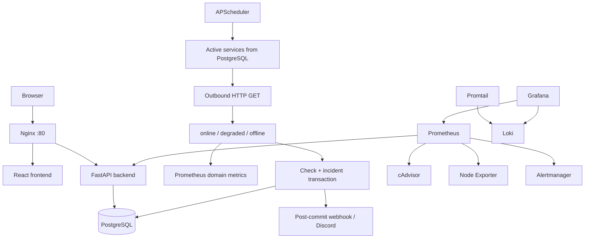

# Architecture

## System context

Sentinel is a single-node Docker Compose application that monitors registered HTTP endpoints. Nginx is the user-facing entry point, FastAPI owns application behavior, PostgreSQL is the source of truth, and an embedded APScheduler job performs monitoring work.



## Component responsibilities

| Component | Responsibility |
| --- | --- |
| Nginx | Publishes port 80 and routes `/` to the frontend and `/api`, `/health`, and `/metrics` to the backend |
| React/Vite frontend | Authenticated operational interface for dashboards, services, checks, incidents, responsibles, alerts, and users |
| FastAPI backend | HTTP API, authentication, RBAC, business rules, domain metrics, and scheduler lifecycle |
| APScheduler | Starts inside the backend process and triggers periodic checks in UTC |
| PostgreSQL | Durable source of truth for users, services, checks, incidents, alert channels, notification attempts, and responsibles |
| Prometheus | Scrapes application, container, and host metrics and evaluates five alert rules |
| Alertmanager | Receives Prometheus alerts through the internal Compose network; the current default receiver has no external integration |
| Grafana | Provisions the Prometheus and Loki datasources and the `sentinel-overview` dashboard |
| Loki and Promtail | Store and collect Docker container logs |
| cAdvisor | Exposes metrics for real Docker containers |
| Node Exporter | Exposes host CPU, memory, filesystem, disk, and network metrics |

## Backend boundaries

```text
app/
  api/routes/       request handling and authorization dependencies
  core/             settings, security, enums, errors, periods, and logging
  db/               SQLAlchemy session and initial administrator
  models/           persisted entities
  observability/    custom Prometheus metrics and collectors
  repositories/     persistence operations and aggregate queries
  schemas/          API request and response contracts
  services/         business rules and notification delivery
  workers/          scheduling and health-check orchestration
```

Routes delegate to services, and services use repositories. The health-check worker is the transaction owner for the check/incident workflow; repositories used by that workflow flush and refresh instead of committing independently.

## End-to-end monitoring flow

1. A user registers a service and its health-check URL.
2. APScheduler triggers `execute_healthchecks` at `HEALTHCHECK_INTERVAL_SECONDS`, starting approximately five seconds after backend startup.
3. The worker reads active services and releases that database session.
4. HTTPX performs one outbound `GET` per service, with redirects enabled and a configured timeout. Network execution occurs outside the persistence transaction.
5. A monotonic clock measures duration. HTTP 200–399 is `online` unless it exceeds the degraded threshold; slow successful responses are `degraded`; other responses and network failures are `offline`.
6. The result status and duration are recorded in the outbound Prometheus counter and histogram.
7. A new database session persists the health check and synchronizes its incident in one outer transaction.
8. Unhealthy checks update an existing open incident or open one after the configured threshold. An online check resolves an open incident and records resolution time and duration.
9. The outer transaction commits exactly once after both persistence operations succeed. Any failure rolls it back.
10. Only after commit, an incident-opened or incident-resolved transition may invoke the existing notification channels.
11. The frontend reads persisted operational state; Prometheus reads both process metrics and scrape-time database-backed gauges; Grafana visualizes Prometheus and Loki data.

## Consistency and concurrency guarantees

### Atomic check and incident state

The external request is deliberately outside the database transaction, avoiding a long-lived transaction while waiting on a remote service. Once a result exists, `persist_check_and_sync_incident`:

1. adds and flushes the check;
2. creates, updates, or resolves the incident;
3. commits the outer transaction once.

If check persistence or incident synchronization fails, `rollback()` removes both changes. Failed transactions produce no notification. Notification failures occur after commit and therefore do not reverse persisted operational state.

### One open incident per service

Migration `0005_unique_open_incident` creates the PostgreSQL partial unique index:

```text
uq_incidents_service_id_open ON incidents(service_id) WHERE status = 'open'
```

Resolved incidents do not participate in the uniqueness predicate, so history remains intact and a later incident can open.

Incident creation uses `Session.begin_nested()`, which maps to a PostgreSQL savepoint. If two workers try to open an incident for the same service, only the named `uq_incidents_service_id_open` violation is handled. PostgreSQL rolls the failed statement back to the savepoint, leaving the outer transaction usable. The losing worker fetches the competing open incident, explicitly receives `created=false`, emits no `INCIDENT_OPENED` transition, and can still commit its check. Unrelated `IntegrityError` instances propagate and roll back the outer workflow.

### Persisted observability

`sentinel_open_incidents` and `sentinel_service_availability_ratio` are collected from PostgreSQL at scrape time rather than maintained as process-local gauges. This survives application restarts and reflects committed state. Collector failures omit the affected metric from that scrape, close any created session, and do not suppress unrelated Prometheus metrics.

## Initialization and deployment

The backend entrypoint applies `alembic upgrade head` before Uvicorn starts. During application lifespan startup it configures logging, ensures the initial administrator exists, and starts APScheduler when `ENABLE_HEALTHCHECK_WORKER=true`.

All services share `sentinel_internal`. Only Nginx (80), Prometheus (9090), and Grafana (3000) publish host ports. Named volumes persist PostgreSQL, Prometheus, Alertmanager, Grafana, and Loki data.

Every service has an explicit CPU and memory limit. PostgreSQL, backend, Prometheus, Loki, and Grafana also have memory reservations. The stack-wide theoretical maximum is 7 CPUs and 2.875 GiB of memory; these limits target local demonstrations, not production capacity planning.

## Decisions and alternatives

| Decision | Benefit | Trade-off / alternative |
| --- | --- | --- |
| APScheduler inside FastAPI | One deployable backend and simple local operation | Multiple replicas could schedule duplicate work; a dedicated queue/worker with leader election would support horizontal scaling |
| Sequential active-service checks | Predictable flow and straightforward transactions | Check duration grows with service count; bounded concurrency could improve throughput |
| Global consecutive-failure threshold | Suppresses transient failures with little configuration | Delays incident creation and cannot be tuned per service |
| PostgreSQL partial unique index | Database-enforced open-incident invariant | Relies on PostgreSQL-specific indexing and savepoint behavior |
| 24-hour database-backed availability | Restart-safe, committed state on every scrape | Each scrape performs an aggregate database query |
| Post-commit direct notification | Never notifies for rolled-back transitions | No durable retry/outbox if the process stops after commit |
| Docker Compose | Reproducible full-stack demonstration | Single-node, local volumes, and no built-in high availability |
| Static resource limits | Bounds host consumption | Limits require workload-specific adjustment and do not replace production orchestration |

## Current limitations

- The scheduler is coupled to the backend and is safe only for the current single-replica scheduling model.
- Active services are checked sequentially.
- The stack has no multi-node failover or managed external persistence.
- Named Docker volumes are local to one host.
- Notifications have no persistent queue, transactional outbox, or coordinated retry worker.
- SMTP, distributed tracing, refresh tokens, token revocation, MFA, and application-managed TLS are not implemented.
- Prometheus and Grafana host ports rely on the local environment for access control.
